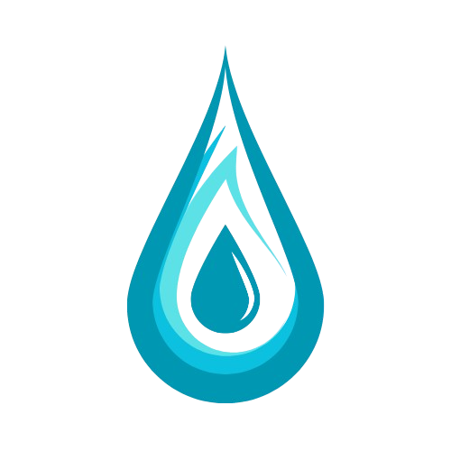
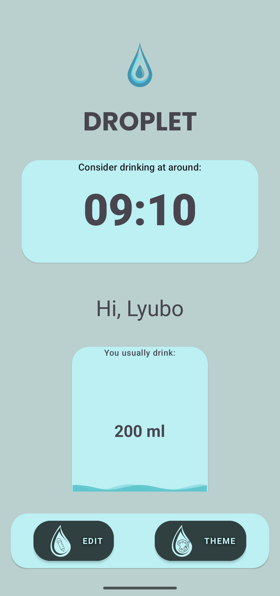
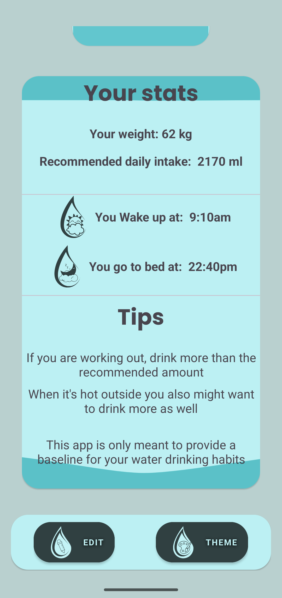
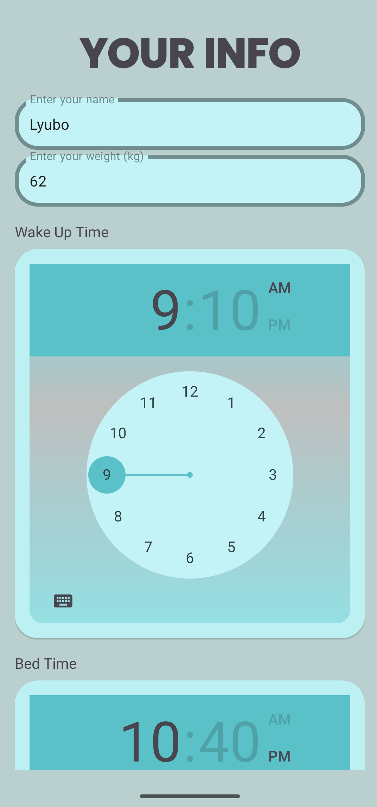
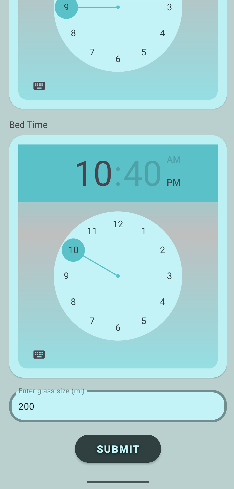

# Droplet

## About Droplet
Droplet is an android water reminder app that should remind you to drink more water. It's supposed to adapt to your personal water drinking habits by taking into account your wake up time, bedtime, weight in kg and water cup size in ml to calculate reminders spread evenly through your active day. The app follows the baseline of 35ml per kilogram of bodyweight for adult people to determine the optimal water drinking goal for the day. 
    
 Of course this app is meant to serve as a baseline towards healthier water drinking habits and is by no means intended to replace medical advice.
 For health concerns with water drinking and related topics, please seek your doctor's advice.

## Features
Droplet provides several features:
- Reminders that follow your schedule
- Easy way to edit your info
- User-friendly interface
- Support for day/night mode and Material You/Dynamic color theme on supported devices
- Support for predictive back gesture animation in Android 14

## Installation
### Method 1- Check Releases
1. Go to the [releases](https://github.com/Lyubo33/DropletWaterReminder/releases) tab and download the latest apk to your device
2. Run the apk, you might be prompted to allow running third party apps from unknown sources, or  that the file might be dangerous. This is because of Google's policy
towards third party applications, the app is safe so you can just run anyway. You could scan the file with play protect to verify it's safe.

### Method 2- Build yourself
1. Clone this repo, open it in Android Studio and build the apk or the bundle yourself

    git clone https://github.com/Lyubo33/DropletWaterReminder.git
   

## Usage
1. Fill the your info form and reminders will be scheduled automatically
2. If you need to edit some values just click on the edit button and refill the targeted fields in the form
3. To change the theme of the app, use the theme button to view the menu
4. On initial open Droplet will prompt you to give it permision to set up alarms and use its notification channel. You need to provide these to let app function
5. All the info you put in the form is stored within the Shared Preferences of the app.

## Known Limitations
- The app is intended for usage on Android 9 and above(Minimum SDK level 28).
- Tested on Pixel 6a, Samsung Galaxy A51, S20, S24, Huawei P20 lite and Xiaomi Redmi Note 9
- Because of Android's battery optimizations the reminders might not trigger on the exact scheduled time, since this also aligns with general user habits, the next 
reminder time can always be seen inside the app.
- Reminders might not trigger in background on battery saver, since scheduled background notifications are a tasking process and at this point Android is concerned with saving battery.
- The app doesn't track how much water you actually drink, it incentivises you to follow better habits, it's all on you to see it through.
## Resources
- [Canva](https://www.canva.com/) for all the icons in the app
- [Serato Studio(DAW)](https://serato.com/) to create the notification sound
- [Lottie](https://lottiefiles.com/integrations) for the background animations in the app 
- [Android Studio](https://developer.android.com/studio) to create and build Droplet

## Screenshots

## Contributing
Contributers are welcome, if you wish to do so, please submit a pull request

## Contact
If you have any questions feel free to reach out to me at [lyubopetrov13@gmail.com](mailto:lyubopetrov13@gmail.com)

